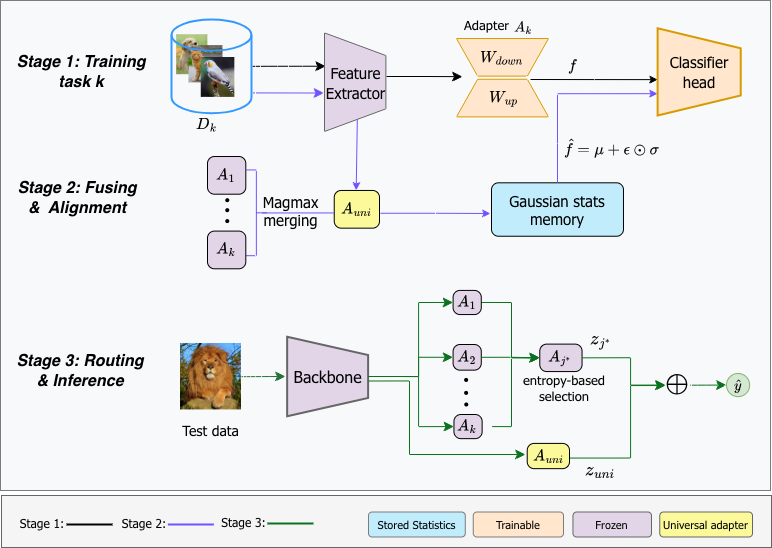

# MUSE

Mixture of Universal and Specific Adapters with Entropy-Guided Routing for Generalized Class-Incremental Learning

Generalized Class-Incremental Learning (GCIL) closely mirrors real-world data streams, requiring models to continually learn from overlapping, imbalanced class distributions without catastrophic forgetting. Existing exemplar-free methods typically face a rigid trade-off: they either suffer from severe task-recency bias or rely on entirely frozen representations that inherently limit plasticity. To break this bottleneck, we propose MUSE (Mixture of Universal and Specific Adapters with Entropy-Guided Routing), a highly plastic yet stable exemplar-free framework for GCIL. Specifically, for each new task, MUSE trains a dedicated low-rank adapter (LoRA) at every $qkv$, $proj$, $fc_1$, and $fc_2$ projection of a frozen Vision Transformer, while strictly freezing all previously learned task adapters. To consolidate accumulated knowledge, we maintain a universal adapter continuously fused from past task adapters via per-coordinate max-magnitude selection (MagMax), forming a compact mixture of task-specific expertise. Imbalance-induced classifier bias is further neutralized by a post-task Classifier Alignment phase, which calibrates decision boundaries using per-class Gaussian pseudo-features derived directly from this universal adapter. At inference, test samples are dynamically routed across task adapters via prediction-entropy minimization, then synergistically combined with the universal adapter for robust prediction. Extensive experiments on CIFAR-100, ImageNet-R, and Tiny-ImageNet demonstrate that MUSE comprehensively outperforms existing exemplar-free state-of-the-art methods.


## Setup

```bash
conda env create -f environment.yaml
conda activate MUSE
```

Python 3.10, PyTorch 1.13 + CUDA 11.7, `timm==0.6.12`. The pin matters — newer `timm` will break the `deit_small_patch16_224` registration in `models/__init__.py`.

### Datasets

We provide the source code on three benchmark datasets, i.e., CIFAR-100, ImageNet-R and Tiny-ImageNet. 

### Download the Pre-trained Model

For all experiments in the paper, we use a deit vit backbone pre-trained on 611 ImageNet classes after excluding 389 classes that overlap with CIFAR and Tiny-ImageNet to prevent data leakage.

Please download the pre-trained deit vit network provided by [Learnability and Algorithm for Continual Learning](https://github.com/k-gyuhak/CLOOD.git) from

https://drive.google.com/file/d/1uEpqe6xo--8jdpOgR_YX3JqTHqj34oX6/view?usp=sharing

 and save the file as ./models/best_checkpoint.pth
## Running

Each method has a shell script under `scripts/` that encodes the per-dataset hyperparameter table and loops over 5 seeds:

```bash
bash scripts/muse.sh         # run MUSE on the dataset set inside the script
bash scripts/gacl.sh         # GACL baseline
bash scripts/er.sh           # ER baseline
# ...
```

Switch dataset by editing the `DATASET=` line near the top (`cifar100` / `tinyimagenet` / `imagenet-r`).

Single seed, single dataset:

```bash
python main.py \
  --mode muse --dataset cifar100 --n_tasks 5 --n 50 --m 10 --rnd_NM \
  --model_name vit --opt_name sgd --sched_name default \
  --lr 5e-3 --batchsize 64 --online_iter 3 --memory_size 0 \
  --lora_rank 16 --lora_alpha 32 --adapter_targets "qkv,proj,fc1,fc2" \
  --cosine_scale 20.0 \
  --ca_lr 0.005 --ca_epochs 10 --ca_samples 256 --shrink_k 10.0 \
  --use_amp --gpu_transform --n_worker 4 \
  --data_dir local_datasets --rnd_seed 1 --note MUSE --eval_period 1000
```